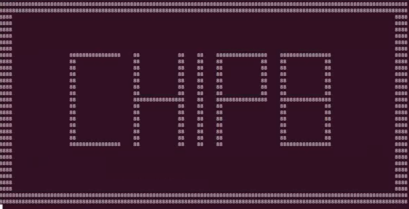

# 🎱 Emojicode CHIP-8️⃣ Emulator

moob boon

# 🔨 Setup
<<<<<<< HEAD
emojicode is wack and doesn't work on windows so u have to be running macOS or Linux <br>
=======
emojicode is wack and doesn't work on windows so u have to be running the emulator on macOS or Linux <br>
>>>>>>> b005e2defd67a2097a361e7e8b2097015e4f404c

make sure you have ncurses and tinfo installed on your machine: <br>
```
sudo apt install libncurses5-dev
sudo apt install libcurseesw5-dev
sudo apt install libtinfo-dev
```

ensure you extract the archive files (`.a` files) into  `packages/keyboard/ncurses` and `packages/keyboard/tinfo` for each respective library. This can be done using the following commands: <br>
```
$ ar x /usr/lib/x86_64-linux-gnu/libncurses.a` <br>           
$ ar x /usr/lib/x86_64-linux-gnu/libtinfo.a` <br>
```
(these steps are neccessary so that we can get keyboard input)
